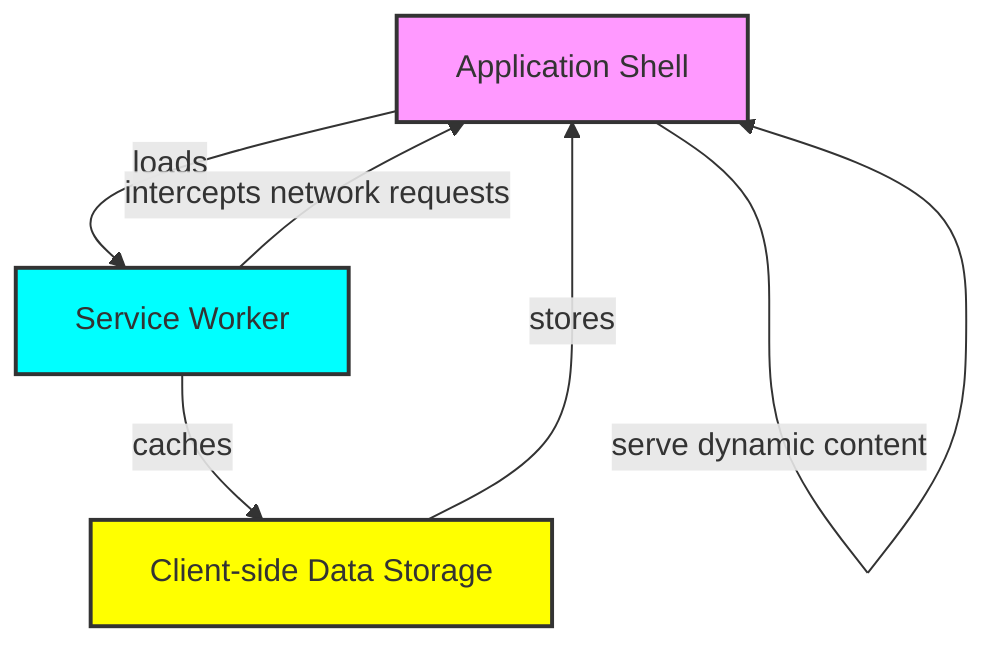

<!-- General project links -->
[itm-opensource]: https://opensource.muenchen.de/
[license]: ../LICENSE
[code-of-conduct]: ./CODE_OF_CONDUCT.md

<!-- Project specific links -->
[vuejs]:  https://vuejs.org/

<!-- Shields.io links -->
[documentation-shield]: https://img.shields.io/badge/documentation-blue?style=for-the-badge
[made-with-love-shield]: https://img.shields.io/badge/made%20with%20%E2%9D%A4%20by-it%40M-yellow?style=for-the-badge
[license-shield]: https://img.shields.io/github/license/it-at-m/sitzverteilung?style=for-the-badge

# Sitzverteilung

[![Made with love by it@M][made-with-love-shield]][itm-opensource]
[![GitHub license][license-shield]][license]

The `Sitzverteilung` is a [Vue][vuejs]-based Progressive Web App developed by it@M to calculate the seats for local elections, defined by law.

## Features

- Creation of reusable templates
- Forming of factions and committees
- Calculation of seat distribution and order for different formulas: 
  - [Hare/Niemayer](https://www.bundeswahlleiterin.de/en/service/glossar/h/hare-niemeyer.html)
  - [Sainte-Lague/Schepers](https://www.bundeswahlleiterin.de/en/service/glossar/s/sainte-lague-schepers.html)
  - [D'Hondt](https://www.bundeswahlleiterin.de/en/service/glossar/d/d-hondtsche-sitzverteilung.html)
- Detection of stale situations
- Various validation checks to detect improper constellations 
- Link-based sharing functionality for templates and individual calculations
- PDF export of calculation results

## Usage

Instructions on how to use the app are directly integrated.

You can open the instructions on the different pages using the "Information" button at the top of each page.

> [!NOTE]
> The app is currently only available in German.

## Technologies and Tools used

Application-related:

- Programming Language: [TypeScript](https://www.typescriptlang.org/)
- Frontend Framework: [Vue.js](https://vuejs.org/)
- UI Component Library: [Vuetify](https://vuetifyjs.com/en/)
- PDF Creation: [jsPDF](https://raw.githack.com/MrRio/jsPDF/master/docs/index.html)
- State Management: [Pinia](https://pinia.vuejs.org/)
- PWA support: [PWA Vite Plugin](https://vite-pwa-org.netlify.app/)

Development-related:

- Build Tool: [Vite](https://vite.dev/)
- Testing Framework: [Vitest](https://vitest.dev/)
- Linting Tool: [ESLint](https://eslint.org/)
- Formatting Tool: [Prettier](https://prettier.io/)

# Architecture

"Sitzverteilung" is a client-only progressive web app (PWA) designed to function entirely within the user's browser, leveraging the capabilities of modern web technologies without relying on external APIs for data retrieval or processing.

Its architecture primarily consists of three key components:
- **Application Shell**: The application shell is the fundamental structure of the PWA, providing a seamless and responsive user interface as well as dynamic content. This approach ensures that the app remains fast and responsive without additional API calls.
- **Service Worker**: The service worker acts as a proxy between the web app and the network, enabling features such as offline functionality and caching. It intercepts network requests, allowing the app to serve cached resources when the user is offline or when the network is unavailable. By pre-caching essential assets and data during the installation phase, the service worker ensures that the app remains functional even without an internet connection.
- **Client-side Data Storage**: Since the app does not communicate with external APIs, it relies on client-side storage solutions to manage data. This can be achieved through Local Storage, which store data directly in the user's browser. This storage mechanism allows the app to read and write data locally, enabling functionalities such as user preferences, application state, and other relevant information without needing external servers.

## Development

If you want to help developing this application, the development setup is very straightforward.
The only prerequisite is to have [Node.js](https://nodejs.org/en/download) in version `22.14` to `22.x` (including `npm`) installed on your system.

The setup involves the following steps:

1. Clone this repository (`git clone https://github.com/it-at-m/sitzverteilung.git`)
2. Switch to the frontend directory (`cd sitzverteilung-frontend`)
3. Install the NPM dependencies (`npm install`)
4. Start the development server (`npm run dev`)
5. Happy developing!

Additionally, provided are some useful npm scripts for development:

- Run tests: `npm run test`
- Run formatting and linting checks: `npm run lint`
- Autofix formatting and linting checks: `npm run fix`

## Contributing

Contributions are what make the open source community such an amazing place to learn, inspire, and create. Any contributions you make are **greatly appreciated**.

If you have a suggestion that would make this better, please open an issue with the tag "enhancement", fork the repo and create a pull request. You can also simply open an issue with the tag "enhancement".
Don't forget to give the project a star! Thanks again!

1. Open an issue with the tag "enhancement"
2. Fork the Project
3. Create your Feature Branch (`git checkout -b feature/AmazingFeature`)
4. Commit your Changes (`git commit -m 'Add some AmazingFeature'`)
5. Push to the Branch (`git push origin feature/AmazingFeature`)
6. Open a Pull Request

More about this in the [CODE_OF_CONDUCT][code-of-conduct] file.

## License

Distributed under the MIT License. See [LICENSE][license] file for more information.

## Contact

[it@M][itm-opensource] - opensource@muenchen.de
